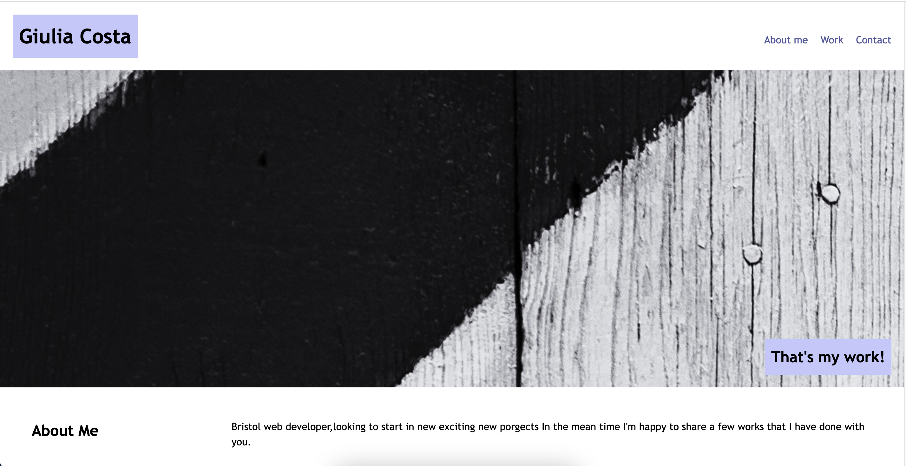
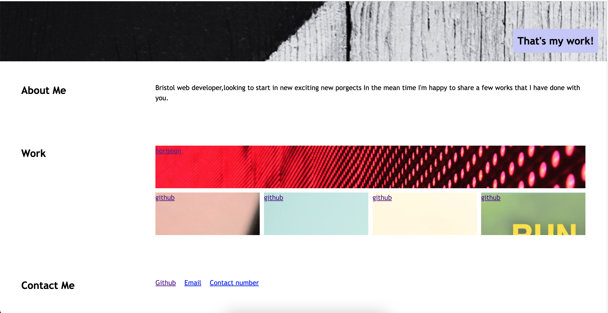

# portfolio

## Description

I decided to work on this important project because it's going to be very useful for my career, in which I'm going to show future employers my work.
The projects are linked to the first project that I have done during the course, and the others for the time being are linked to GitHub. The page is visible on different screens.

I have learned how to use CSS and how to style a page using flexbox, media queries, and CSS variables and how to work on different platforms (Visual Studio Code, the terminal, GitHub), and how to make sure that everything aligns with the initial wireframe.

The deployed version you can find here: https://costagiu.github.io/portfolio

## Usage

  
To open the webpage open index.html in your webbrowser. It should look like this:

## Credits

I used [W3Schools](https://www.w3schools.com/) as a reference for HTML and CSS flexbox, media queries, and CSS variables.

I used [codingbootcamp](https://coding-boot-camp.github.io/full-stack/github/professional-readme-guide) as a guide to write this README.
